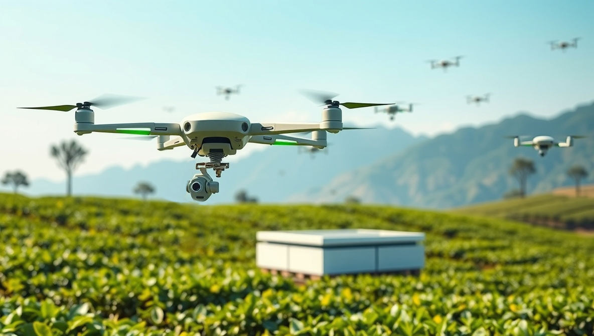

# AI-Powered Tea Leaf Harvesting Drone Swarm (Public Domain Concept)

This project presents an open and publicly documented concept for an autonomous tea leaf harvesting system using AI-powered lightweight drones. These drones can detect and pluck tea leaves, collect them in small bags, and return to a central hub for unloading before continuing the process. The system operates as a coordinated swarm, similar to how bees collect nectar, all managed by a central wireless control system.

The idea is released into the **public domain** by the author, Kasun Miuranga, to ensure that no individual or entity can restrict its use through patents. Anyone is free to build upon or develop this idea.

👉 **Read the full concept page here:**  [View Concept Page](https://themiu.github.io/ai-tea-leaf-drone-swarm/)

---

### Summary
- Drones identify and harvest tea leaves using AI vision.
- A central system coordinates a swarm of drones.
- The idea promotes open innovation in agricultural automation.

---

### Author
**Kasun Miuranga**  
Publicly disclosed on **May 15, 2025**

> Generated with the help of ChatGPT (OpenAI), based on original ideas by Kasun Miuranga.
